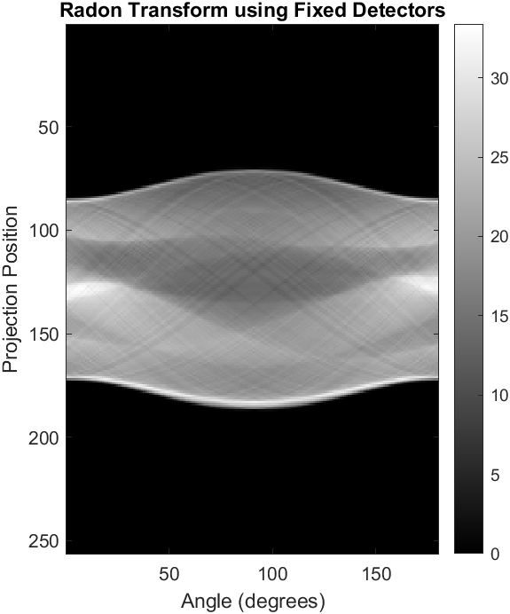
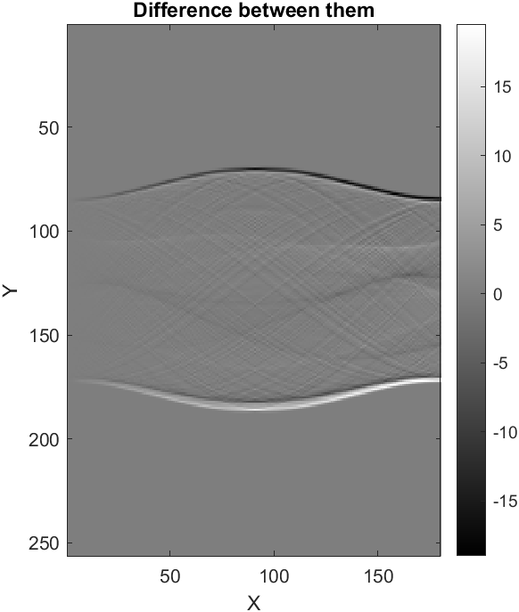

# Radon Implementation 

This repository contains MATLAB code for implementing the Radon transform. The Radon transform is a mathematical operation that maps a function or an image from its domain into the space of lines in its codomain. This transformation is widely used in medical imaging, particularly in computed tomography (CT) scanning, where it forms the basis of image reconstruction algorithms.

## Theory
The Radon transform is a mathematical operation that takes a function defined on a two-dimensional plane (usually an image) and maps it into a function defined on a space of lines in the plane. It is widely used in medical imaging, computed tomography (CT) scanning, and other fields to reconstruct images from projections.

In Radon transform theory, a function f(x, y) represents an image or any two-dimensional object. The Radon transform R_f(θ, t) of f at angle θ and distance t is obtained by integrating f along lines that are parallel to a specified direction θ and located at distance t from the origin.

The Radon transform is particularly useful in applications such as medical imaging because it provides a way to analyze an object's internal structure from external measurements. By collecting projections of an object from different angles, one can reconstruct a detailed image of the object using inverse Radon transform techniques. This makes it a fundamental tool in fields where non-invasive imaging is essential for diagnosis and analysis.

## Implementation

This repository provides MATLAB scripts for implementing the Radon transform for two common scenarios:

### Detectors in Place

The `RadonImplementation_DetectorsFixed.m` script demonstrates the implementation of the Radon transform when the detectors remain stationary while the image is rotated. This scenario simulates a typical setup in medical CT scanning.

### Image in Place

The `RadonImplementation_ImageFixed.m` script illustrates the scenario where the image remains stationary while the detectors rotate around it. This configuration is often used in industrial CT scanning and non-destructive testing applications.

Both scripts utilize MATLAB's built-in functions for performing line integrals and generating Radon projections. They provide a practical demonstration of how the Radon transform can be applied in real-world scenarios.

## Result

  
  
  

## Usage

To use the scripts:

1. Ensure you have MATLAB installed on your system.
2. Clone or download this repository to your local machine.
3. Open MATLAB and navigate to the directory where you saved the repository.
4. Run either `RadonImplementation_DetectorsFixed.m` or `RadonImplementation_ImageFixed.m` script depending on the scenario you want to simulate.
5. Follow the instructions provided in the comments within the script files to adjust parameters and understand the implementation.

## Acknowledgements
This implementation is part of the course work for EE5613: Medical Imaging: Unveiling CT Imaging from Physics to AI Advancements
